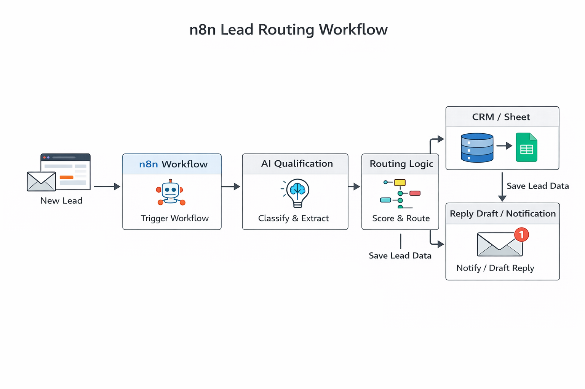

# n8n Lead Routing Demo

Lead capture, AI qualification, and routing workflow demo built for small businesses.

## What it does

This project demonstrates an automated lead-handling workflow that:

- receives a new lead from a form or inbox
- analyzes the enquiry with AI
- scores or qualifies the lead
- extracts useful business details
- routes the lead to the right destination
- drafts a follow-up or notification

## Example use cases

- service businesses handling contact form leads
- agencies triaging inbound project enquiries
- consultants qualifying prospects before calls
- internal sales/ops lead distribution

## Example workflow

1. A new lead is submitted through a form or captured from email
2. The workflow sends the lead details into n8n
3. AI classifies the enquiry and extracts key data
4. The lead is scored or tagged
5. The workflow routes the lead to the right place
6. A follow-up action is triggered

## Workflow Diagram

## Business value

Manual lead sorting is slow and inconsistent. This workflow shows how a business can reduce admin work, respond faster, and keep lead handling structured from the start.

## Example outputs

- qualified lead
- unqualified lead
- urgent lead
- partnership enquiry
- support request misrouted as sales
- spam or irrelevant submission

## Stack direction

- n8n
- AI model for classification and extraction
- Google Sheets / CRM / email destination
- optional dashboard or review layer

## Project Files

- [Workflow overview](docs/overview.md)
- [Example lead inputs](sample-data/example-leads.json)
- [Example routed outputs](sample-data/example-routed-output.json)
- [Qualification prompt](prompts/lead-qualification-prompt.md)
- [Workflow notes](workflow/n8n-workflow-notes.md)

## Notes

This is a public showcase project intended to demonstrate automation design and implementation capability.
No real client data, secrets, or confidential workflow logic are included.

## Contact

Built by Ndala  
For freelance or consulting work: `ndalabuilds@esinya.com`
